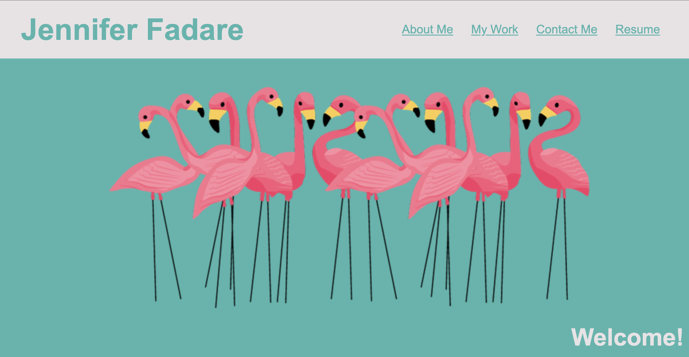
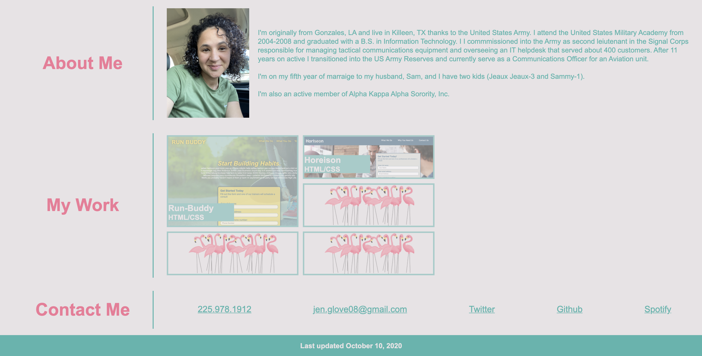

# JenniferFadarePortfolio

## Purpose
To display my work on a website so future employers can see my applied skills in webdevelopment.

## Built With

* HTML
* CSS

## Website

https://jenniferfadare.github.io/JenniferFadarePortfolio

## Website Mock Up

## Thought Process for designing this website

I wanted this website to reflect my work.  Even though I have basic knowledge of how to design and make a website from scratch, I'm extremely happy with how this turned out.

I *love* flamingos! The funnest part of this project was trying to find pictures of flamingos to put on the banners and place holders (maybe took too long for that part).

The part I dreaded was doing the photo gallery for my work.  I kept the transitions simple because I didn't want to break the site or spend too long on it, but I feel better about my ability to apply and understand flexboxes and grids.

One part that needs to be improved is the UI that allows navigation to the work if the user clicks anywhere in the container boxes.  I think this will be easy to do with javascript when i learn it.

Not inclcuded in this assignment as a requirement, but something I thought was important, is a footer that shows the last time the site was updated so that others can see that I actively work and update my personal site.

The other thing that is on my list of things to do is to finish my resume so I can link it to the site, then give the user the ability to print it out.

Either case, I'm happy to be some what done with this. 

## Contribution

:heart: Jennifer Fadare

